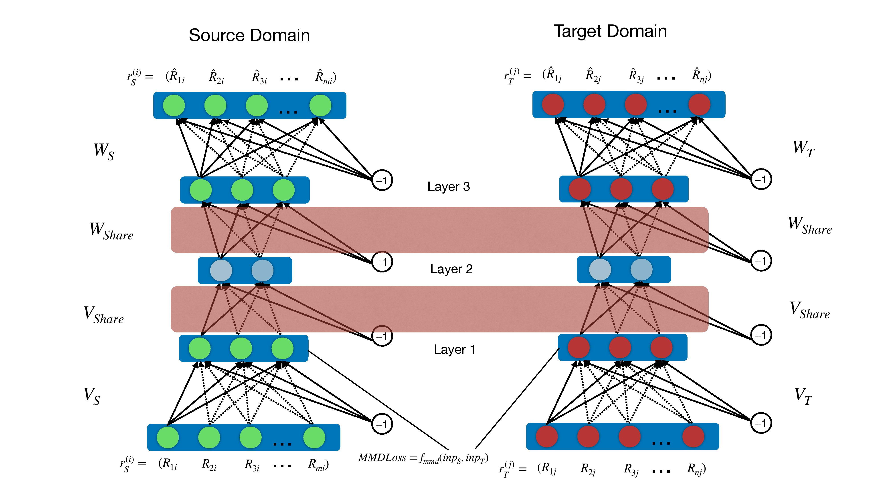
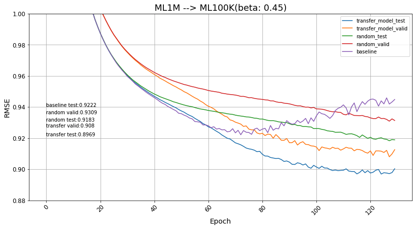
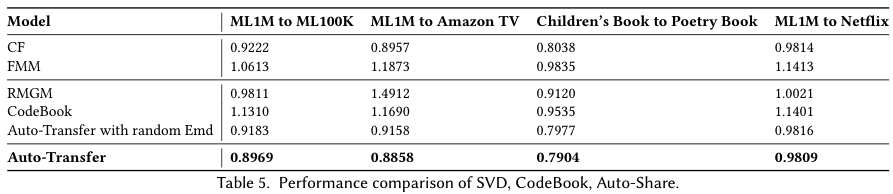

# Learning Domain-independent Representations for Transfer Learning in Recommender Systems

This repository is the official implementation of [Learning Domain-independent Representations for Transfer Learning in Recommender Systems](). 

<p align="center">

</p>

## Installation

To install requirements, download and install the Python 3.7 version of [Miniconda](https://docs.conda.io/en/latest/miniconda.html) or [Anaconda](https://www.anaconda.com/distribution/#download-section).

Then run the following commands to create a conda environment named `auto-rec` with Python 3.7, and clone this repository into a folder named `auto-rec ` your machine.

```bash
conda create -n auto-rec python=3.7
conda env update --name auto-rec --file environment.yml
```

<!-- > 📋Describe how to set up the environment, e.g. pip/conda/docker commands, download datasets, etc... -->

## Training
## Quick start please check 
For a quick walkthrough on how to run `Auto-share model`, take a look at the [run.py](run.py).
For train the model from scratch
```bash
python run.py
```
<!-- 
```train
python train.py --input-data <path_to_data> --alpha 10 --beta 20
```

> 📋Describe how to train the models, with example commands on how to train the models in your paper, including the full training procedure and appropriate hyperparameters. -->

## Evaluation

<!-- To evaluate my model on ImageNet, run:

```eval
python eval.py --model-file mymodel.pth --benchmark imagenet
```
 -->

We use six datasets for evaluation: Ml1M and Children's book datasets are chosen as source domain datasets, as they have high densities, thus containing more information.
We show the evaluation result on ML1M --\> ML100K as an example with the beta = 0.45 
<p align="center">

</p>


## Results
Our model achieves the following performance on different datasets comparing with different models:

<p align="center">

</p>

<!-- Our model achieves the following performance on :

### [Image Classification on ImageNet](https://paperswithcode.com/sota/image-classification-on-imagenet)

| Model name         | Top 1 Accuracy  | Top 5 Accuracy |
| ------------------ |---------------- | -------------- |
| My awesome model   |     85%         |      95%       |

> 📋Include a table of results from your paper, and link back to the leaderboard for clarity and context. If your main result is a figure, include that figure and link to the command or notebook to reproduce it. 
 -->

## Contributing

> 📋Pick a licence and describe how to contribute to your code repository. 
